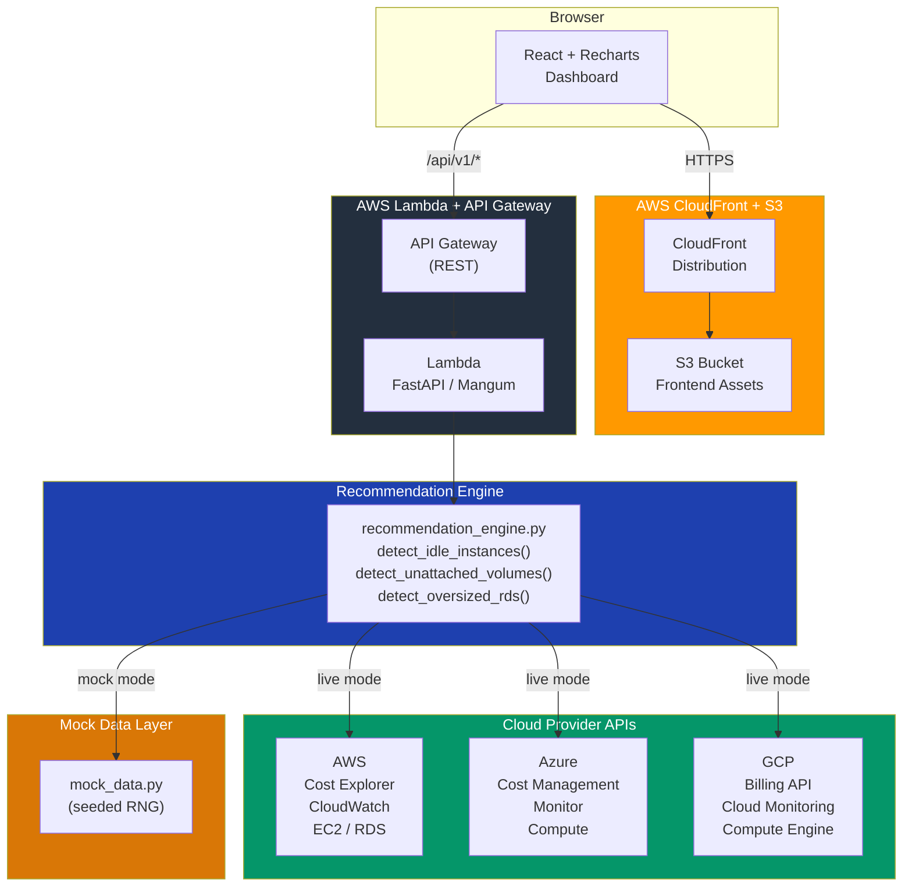
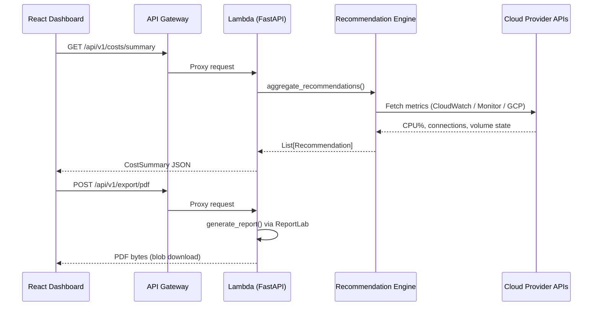

# CloudLens — Multi-Cloud Cost Optimizer

> Detect cloud waste. Quantify savings. Act fast.

CloudLens continuously analyses your AWS, Azure, and GCP environments to surface idle resources, orphaned storage, and over-provisioned databases — with projected monthly savings per recommendation.

[](https://github.com/your-org/cloudlens/actions/workflows/ci-cd.yml)
[](https://codecov.io/gh/your-org/cloudlens)
[](https://www.python.org/)
[](https://fastapi.tiangolo.com)

---

## Architecture



### Data Flow



---

## Features

| Feature | Detail |
|---|---|
| **Idle EC2 / VM detection** | Flags instances averaging < 5% CPU over 7 days |
| **Unattached EBS volumes** | Surfaces volumes unattached for > 30 days |
| **Oversized RDS / Cloud SQL** | Detects low-utilisation databases eligible for downsizing |
| **Savings projection** | Per-recommendation monthly USD savings estimate |
| **Multi-provider** | AWS, Azure, GCP in a single dashboard |
| **PDF report export** | One-click professional report via ReportLab |
| **Mock data mode** | Full demo without any cloud credentials |
| **Terraform IaC** | S3, CloudFront, Lambda, API Gateway wired up |
| **GitHub Actions CI/CD** | Test → build → deploy on every main push |

---

## Quick Start (Demo Mode)

### Prerequisites

- Python 3.12+
- Node 20+
- (Optional) Docker

### 1 — Clone

```bash
git clone https://github.com/your-org/cloudlens.git
cd cloudlens
```

### 2 — Backend

```bash
cd backend
python -m venv .venv
source .venv/bin/activate      # Windows: .venv\Scripts\activate
pip install -r requirements.txt

# Demo mode — no cloud credentials needed
USE_MOCK_DATA=true uvicorn main:app --reload
# API docs: http://localhost:8000/docs
```

### 3 — Frontend

```bash
cd frontend
npm install
npm run dev
# Dashboard: http://localhost:3000
```

### 4 — Run Tests

```bash
cd backend
pytest -v
```

---

## Configuration

Copy `.env.example` to `.env` in the `backend/` directory:

```dotenv
# Feature flags
USE_MOCK_DATA=true          # Set false for live cloud data
LOG_LEVEL=INFO

# AWS (required when USE_MOCK_DATA=false)
AWS_ACCESS_KEY_ID=
AWS_SECRET_ACCESS_KEY=
AWS_DEFAULT_REGION=us-east-1
AWS_ACCOUNT_ID=

# Azure
AZURE_SUBSCRIPTION_ID=
AZURE_TENANT_ID=
AZURE_CLIENT_ID=
AZURE_CLIENT_SECRET=

# GCP
GCP_PROJECT_ID=
GCP_BILLING_ACCOUNT_ID=
GOOGLE_APPLICATION_CREDENTIALS=/path/to/key.json
```

### Required IAM permissions (AWS live mode)

```json
{
  "Version": "2012-10-17",
  "Statement": [
    { "Effect": "Allow", "Action": ["ce:GetCostAndUsage"], "Resource": "*" },
    { "Effect": "Allow", "Action": ["cloudwatch:GetMetricStatistics", "cloudwatch:ListMetrics"], "Resource": "*" },
    { "Effect": "Allow", "Action": ["ec2:DescribeInstances", "ec2:DescribeVolumes"], "Resource": "*" },
    { "Effect": "Allow", "Action": ["rds:DescribeDBInstances"], "Resource": "*" }
  ]
}
```

---

## Infrastructure Deployment (Terraform)

```bash
cd terraform
terraform init
terraform workspace new prod
terraform plan -var="environment=prod"
terraform apply -var="environment=prod" -auto-approve
```

After apply, outputs include the CloudFront URL and API Gateway endpoint.

---

## CI/CD Pipeline

The GitHub Actions workflow (`.github/workflows/ci-cd.yml`) runs three jobs on every pull request:

| Job | Trigger | Steps |
|---|---|---|
| `backend-ci` | Every push/PR | `pytest` with 80% coverage gate |
| `frontend-ci` | Every push/PR | TypeScript type check + `vite build` |
| `terraform-plan` | PR only | `fmt`, `validate`, `plan` |
| `deploy` | `main` push | Lambda update + S3 sync + CloudFront invalidation |

Deployment uses AWS OIDC (no long-lived credentials stored in GitHub secrets).

---

## API Reference

| Method | Endpoint | Description |
|---|---|---|
| `GET` | `/health` | System health + provider connectivity |
| `GET` | `/api/v1/costs/summary` | Aggregated spend by provider, service, region |
| `GET` | `/api/v1/recommendations/` | All recommendations (filterable) |
| `GET` | `/api/v1/recommendations/{id}` | Single recommendation detail |
| `POST` | `/api/v1/export/pdf` | Generate and download PDF report |

Full interactive docs: `http://localhost:8000/docs`

---

## Key Design Decisions

### FastAPI over Flask / Django

FastAPI gives us async-native request handling, automatic OpenAPI schema generation, and Pydantic v2 for runtime type validation — all critical when proxying slow cloud API calls. The automatic `/docs` endpoint halves integration time for new consumers.

### Pydantic models as the single source of truth

All data shapes live in `app/models.py`. The same models drive API serialisation, internal type hints, and PDF generation. This eliminates the silent drift that happens when separate DTO, ORM, and response classes diverge.

### Pure-function recommendation engine

Each detector (`detect_idle_instances`, `detect_unattached_volumes`, `detect_oversized_rds`) is a pure function: `list[RawT] → list[Recommendation]`. This makes unit testing trivial — no mocking of AWS/Azure/GCP SDKs required. The cloud-fetching layer is a thin adapter that produces `RawInstance` / `RawVolume` / `RawDatabase` structs.

### Stable, deterministic recommendation IDs

Recommendation IDs are SHA-256 hashes of `provider:resource_id:type`. This means the same resource always gets the same recommendation ID across restarts, enabling frontend state persistence, deduplication, and stable deep-links without a database.

### Mock data seeded with a fixed RNG

Demo mode uses `random.Random(seed=42)` so the dashboard shows consistent numbers across restarts. This lets reviewers and investors see a realistic, reproducible demo without touching real cloud accounts.

### Recharts over Chart.js / D3

Recharts is a React-native charting library: components compose naturally with JSX, props mirror React patterns, and it is tree-shakeable. D3 requires imperative DOM manipulation that fights React's reconciler; Chart.js requires a `useEffect` wrapper and canvas refs. Recharts avoids both.

### CloudFront + S3 over Amplify / Vercel

CloudFront + S3 keeps all infrastructure in a single AWS account, avoids vendor lock-in to a hosting platform, and allows fine-grained cache-control headers per asset type (immutable for hashed JS bundles, `must-revalidate` for `index.html`).

### Lambda Function URL alongside API Gateway

The Lambda function URL is used for local testing and simple integrations; API Gateway provides WAF integration, usage plans, and request validation for production. Both are provisioned so operators can choose based on their security posture.

### Terraform over CDK / Pulumi

HCL is the lingua franca of infrastructure teams. Terraform's plan output is human-readable and diff-friendly in pull requests. CDK requires a TypeScript/Python compile step; Pulumi adds a runtime dependency. For a project that will be maintained by mixed-skill teams, plain Terraform is the most accessible choice.

---

## Project Structure

```
cloudlens/
├── backend/
│   ├── main.py                        # FastAPI app entry point
│   ├── requirements.txt
│   ├── pytest.ini
│   ├── app/
│   │   ├── config.py                  # Settings (pydantic-settings)
│   │   ├── models.py                  # All Pydantic models
│   │   ├── routers/
│   │   │   ├── costs.py
│   │   │   ├── recommendations.py
│   │   │   └── export.py
│   │   ├── services/
│   │   │   ├── recommendation_engine.py   # Pure-function detectors
│   │   │   ├── aws_service.py
│   │   │   ├── azure_service.py
│   │   │   └── gcp_service.py
│   │   └── utils/
│   │       ├── mock_data.py           # Seeded deterministic demo data
│   │       └── pdf_generator.py       # ReportLab PDF builder
│   └── tests/
│       ├── test_recommendation_engine.py  # 40+ unit tests
│       └── test_api.py                    # FastAPI integration tests
├── frontend/
│   ├── src/
│   │   ├── App.tsx
│   │   ├── components/
│   │   │   ├── Dashboard.tsx          # Main layout + loading states
│   │   │   ├── CostCharts.tsx         # Recharts: trend, pie, bar
│   │   │   ├── Recommendations.tsx    # Expandable recommendation rows
│   │   │   ├── ExportButton.tsx       # PDF download trigger
│   │   │   ├── StatCard.tsx
│   │   │   ├── SeverityBadge.tsx
│   │   │   └── ProviderBadge.tsx
│   │   ├── hooks/useCloudData.ts      # TanStack Query hooks
│   │   ├── services/api.ts            # Axios client
│   │   └── types/index.ts             # TypeScript types
│   └── package.json
├── terraform/
│   ├── main.tf                        # S3, CloudFront, Lambda, IAM
│   ├── variables.tf
│   ├── outputs.tf
│   └── modules/api_gateway/main.tf
└── .github/workflows/ci-cd.yml
```

---

## License

MIT — see [LICENSE](LICENSE).
